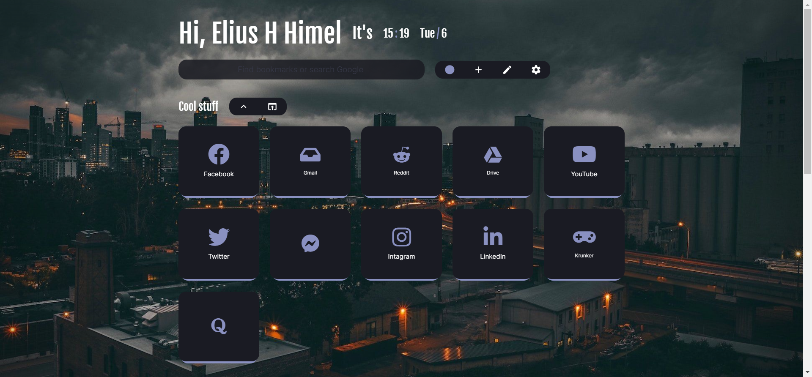

## Chrome Tab Customize

### Use guide

- First add the [NightTab](https://chrome.google.com/webstore/detail/nighttab/hdpcadigjkbcpnlcpbcohpafiaefanki?hl=en-GB) extension from Chrome Web Store.

- Simply copy the raw data from [config.json](/config.json) and paste in the settings of newTab.